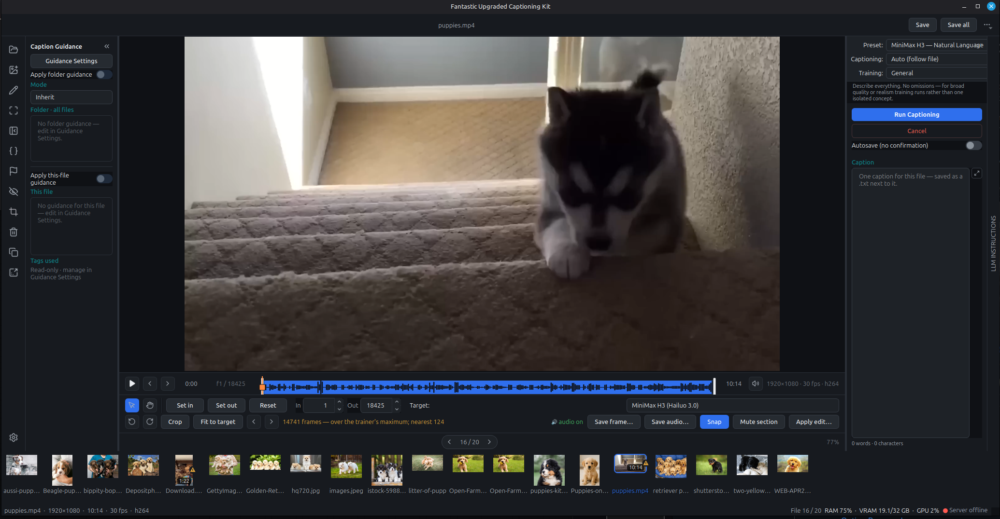
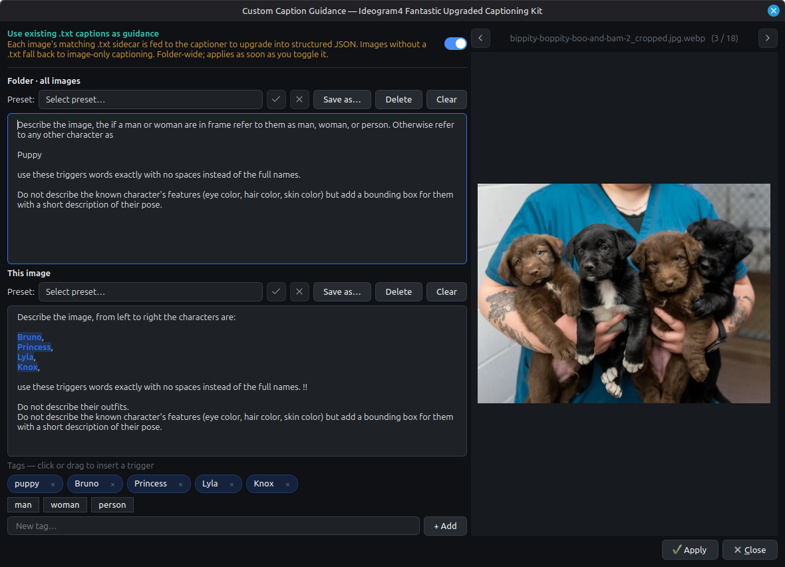
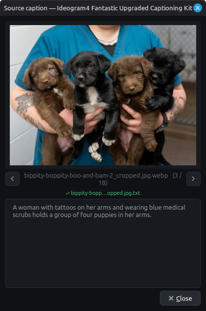

# Fantastic Upgraded Captioning Kit

A local desktop app for building and curating caption datasets for image and
video model training. Open a folder of stills or clips, write or generate
captions in the format your target model expects, trim and conform clips to its
frame grid, and keep everything on your own machine.

Supports **Ideogram 4** (structured fields with bounding boxes), **MiniMax H3**,
**Wan 2.2**, **LTX-2**, and plain text — each with its own caption format and,
for the video models, its own fps and frame-count rules.

Auto-captioning is optional and runs against an OpenAI-compatible model server
that **you** control (local llama.cpp, LM Studio, vLLM, or Ollama). Nothing
leaves your machine except the requests to the endpoint you configure.



## Contents

- [Features](#features)
- [Requirements](#requirements)
- [Installation](#installation)
  - [Quickest start — `start.sh` / `start.bat`](#quickest-start--startsh--startbat)
  - [Option A — venv](#option-a--venv)
  - [Option B — conda](#option-b--conda)
  - [Optional — CUDA acceleration](#optional--cuda-acceleration-for-the-built-in-server-nvidia-linux)
- [Launching](#launching)
- [Basic use](#basic-use)
  - [Working with video](#working-with-video)
- [Configuration](#configuration)
- [Keyboard shortcuts](#keyboard-shortcuts)
- [Troubleshooting](#troubleshooting)
- [License](#license)

## Features

- **Images and video** — One folder can hold both. Clips get a player with a
  waveform, trim brackets, crop, rotate, and a mute-section tool for clipping a
  half-spoken word off the end of a trim.
- **Model-aware conforming** — Each video model has an fps and a legal frame-count
  grid (Wan 4n+1, LTX 8n+1, MiniMax H3 17n+5). Trim handles snap to lengths the
  model accepts, and clips that can't work as-is are flagged with the reason.
- **Training goals** — A second caption axis alongside the format preset: caption
  for a character likeness, a concept, a motion, an art style or a video look.
  Each encodes what to describe and what to leave out, since what you caption
  stays promptable and what you omit gets bound to the trigger.
- **Dataset browsing** — Step through a folder with keyboard shortcuts.
  Sort and filter by name, date, missing captions, or failed jobs, and search
  inside caption sidecars to jump straight to the images you mean.
- **Ideogram 4's structured format** — When that preset is selected, captions are
  edited as proper fields (description, style, background, elements, rendered
  text, colour palette) rather than raw text, with a live raw view alongside and
  bounding boxes you can draw, move, resize and edit numerically on the image.
  Every other preset writes a plain `.txt` beside the file.
- **Caption guidance** — Attach folder-wide and per-image guidance (style,
  characters, things to always mention or avoid) that steers generation, plus
  reusable tag/trigger chips.
- **Local auto-captioning** — Caption a file or a whole folder through a vision
  model you control, refine what comes back, and re-run selectively: only new
  files, changed and new, or everything. Cancel a run at any point. For Ideogram
  4 there's also a bounding-box pass that can regenerate every box or fill in
  only the missing ones.
- **Caption review** — Captions that come back empty, malformed, a model refusal,
  or a duplicate of another file's are flagged automatically after a run, with a
  summary listing them. You can also flag files yourself while a batch is still
  running, then jump straight between flagged ones to fix them.
- **Bypass and backup** — Move files out of the dataset into `.bypass/` without
  deleting them (still individually captionable), and duplicate or back up a
  whole dataset choosing what comes along: captions, settings, originals.
- **Editable model rules** — Frame grids, fps and caption prompts live in data you
  can edit and share as a JSON bundle, so a model released next week doesn't have
  to wait for an app release.
- **Bring your own model** — Pick from suggested Hugging Face GGUF models
  (auto-downloaded and served via llama.cpp), point at local GGUF files, or
  connect to a server you're already running. Your model choices are saved
  locally.

Manual captioning and box editing work fully offline; a model server is only
needed for the auto-captioning features.

## Requirements

- **Python 3.10 or newer**
- **For video:** ffmpeg and ffprobe. The app offers to download a managed copy on
  first use if they aren't on your PATH, so there's nothing to install by hand.
- **For auto-captioning:** an OpenAI-compatible vision model server. The
  built-in option downloads a GGUF model and runs `llama-server` for you; you
  can also connect to LM Studio, vLLM, Ollama, or your own llama.cpp server.
- **For captioning a clip's audio:** a model that can actually hear — an Omni or
  Gemma 4 build. Vision-only models describe lips moving and invent nothing; the
  video stage shows a 🔊/🔇 badge so you know which you have before you run.

## Installation

Clone the repository, then set up an environment with **either** venv or conda.
The UI dependency is a large download (~150–200 MB), so the first install
takes a minute.

```bash
git clone https://github.com/Adudeguyman/Fantastic-Upgraded-Captioning-Kit.git
cd Fantastic-Upgraded-Captioning-Kit
```

### Quickest start — `start.sh` / `start.bat`

One script does everything. On its **first run** it asks whether you'd like to use
conda or a venv, installs accordingly, and remembers your choice in
`.captioner_env`. **Every run after that** it just launches the app.

- **Windows:** double-click `start.bat`.
- **Linux / macOS:**
  ```bash
  chmod +x start.sh   # once
  ./start.sh
  ```

Useful flags:

| Flag | What it does |
| --- | --- |
| `--setup` | Redo setup / switch between conda and venv |
| `--repair` | Reinstall dependencies into the current environment |
| `--cuda` | During setup, also install the NVIDIA NCCL runtime (Linux) |

If the environment goes missing (deleted `.venv`, removed conda env), the script
notices and rebuilds it rather than failing.

Prefer to drive things yourself? Set the environment up manually with venv or
conda below, then run `python -m captioning_kit`.

### Option A — venv

**Linux / macOS**
```bash
python -m venv .venv
source .venv/bin/activate
pip install -r requirements.txt
```

**Windows (PowerShell)**
```powershell
python -m venv .venv
.\.venv\Scripts\Activate.ps1
pip install -r requirements.txt
```

### Option B — conda

```bash
conda create -n fantastic-captioner python=3.11
conda activate fantastic-captioner
pip install -r requirements.txt
```

The dependencies install cleanly with pip inside the conda env, so there's no need to
chase it down on a conda channel.

### Optional — CUDA acceleration for the built-in server (NVIDIA, Linux)

If you let the app download and run `llama-server` on an NVIDIA GPU, recent
llama.cpp CUDA builds link NVIDIA's NCCL library (`libnccl.so.2`) but don't
bundle it. If your environment already has PyTorch, you're covered — the app
reuses the NCCL it ships. Otherwise, add it once:

```bash
pip install -r requirements-cuda.txt        # or:  pip install ".[cuda]"
```

This is a no-op on Windows/macOS and on non-NVIDIA setups (the Vulkan/CPU
backends and external servers like LM Studio don't need it).

## Launching

With your environment activated (venv or conda), launch the app with:

```bash
python -m captioning_kit
```

or equivalently:

```bash
python run_captioner.py
```

## Basic use

1. In **Preferences**, set up your server (Connection/Server) and choose the model
   it will use (Models). For an existing server, click **Refresh** to pick from the
   models it reports. Use **Test Server** to verify the connection. The server status
   is always shown in the bottom-right corner of the main window.

2. Open a folder of images, clips, or both — drag files in or use **Add media** to
   copy more in later. Per-dataset settings (preset, training goal, guidance, tags,
   review flags) are saved in a **.captioner** folder inside it, so they're restored
   the next time you open that folder.

3. Pick a **preset** and a **training goal** at the top of the right-hand panel.
   The preset decides the caption's *format* — Ideogram 4, MiniMax H3, Wan 2.2,
   LTX-2, or plain text. The goal decides its *content*: what to describe and what
   to leave out, depending on whether you're training a character, a concept, a
   motion, an art style or a video look. The two are independent, so any goal works
   with any format.

4. *(Optional)* Open **Guidance Settings** to add instructions for the model:
   - **Folder-level guidance** is appended to every image — e.g. for a consistent
     art style: *"For the high_level_description section, append the suffix
     'in the style of my_art_style'."*
   - **Per-image guidance** targets one image — e.g. when training multiple
     characters: *"From left to right the characters are CharacterOne,
     CharacterTwo…"*
   - **Tags** are part of the image-level guidance — reusable snippets you define
     once and reference as needed while writing an image's guidance, so recurring
     instructions don't have to be retyped per image.

   

5. *(Optional, when available)* **Use existing `.txt` captions as a starting point.**
   If your folder already has plain-text caption files — one `.txt` per file, named
   to match it — the captioner can read each one and rewrite it into the selected
   format, instead of describing the file from scratch. The
   detected source caption is shown in the guidance panel (and in a pop-out you can
   keep open while you browse). Turn it on with the **Use existing .txt captions as
   guidance** toggle in the Caption Guidance panel or in **Guidance Settings**. The
   toggle is only enabled when the folder actually contains matching `.txt` files;
   any image without one simply falls back to image-only captioning.

   

6. Click **Run Captioning** and choose the current file or the whole folder. If
   you run the folder and some files already have captions, a follow-up prompt
   lets you do *only new* files, *changed + new*, or *re-caption everything*.

7. While the folder runs, captions appear as they're generated. The caption editor
   is **read-only** during a run (a banner indicates this), but you can flag any
   image for later review with the **F** key or by right-clicking its thumbnail —
   flagged images show a red flag in the corner, and **Shift+F** jumps to the next
   flagged one.

8. To edit, select an image, change the fields and bounding boxes, then press
   `Ctrl+S` to save. Edits are buffered as you move between images; `Ctrl+Shift+S`
   writes every pending change to disk.

### Working with video

Selecting a clip swaps the image canvas for a player with its own edit bar.

- **Trim** with the brackets on the timeline. With a model target armed, **Snap**
  pulls each edge onto a frame count that model accepts — Wan 4n+1, LTX 8n+1,
  MiniMax H3 17n+5 — so you can't land on a length the trainer would silently
  truncate or pad. A clip too short for the model isn't snapped at all; it's
  flagged instead.
- **Scrub** by dragging the square playhead grip; grab the bar beside it to move a
  trim bracket.
- **Mute section** puts red brackets on the waveform. Playback is silenced inside
  them as you listen, so you can place the cut on a word boundary before writing
  anything. Useful when a trim lands mid-syllable.
- **Crop**, **rotate** and **Save frame** work as they do for stills; the preview
  reflects each change so you're framing against the final orientation.
- **Apply edit** writes the result, keeping the untouched original in `.original/`.
  Unapplied edits are remembered per clip and marked on the filmstrip, so moving
  between clips never loses work.

Clips that don't meet the selected model's fps, length or frame grid carry an
amber triangle; hover it for the specific reason.

## Configuration

Both are created on first run from the bundled `*.example` templates and stay
on your machine:

- **Model profiles** — `captioner_model_profiles.json`
  (*Preferences → Models → Open Profiles File*), seeded from
  `captioner_model_profiles.example.json`. Each profile is a small JSON entry
  pointing at a Hugging Face GGUF (`hf_repo` + `model_filename`, plus
  `mmproj_filename` for vision), a local GGUF file, or an existing-server alias.
- **Prompt overrides** — `captioner_prompts/`
  (*Preferences → Pipeline → Open Prompts Folder*). Copy only the files you want
  to change from `captioner_prompts.example/`; anything you don't override falls
  back to the built-in defaults.

## Keyboard shortcuts

- `Ctrl+O` — open a folder of images
- `Ctrl+S` — save the current image
- `Ctrl+Shift+S` — save all images with pending edits
- `Ctrl+[` / `Ctrl+]` — previous / next image
- `A` / `D` — previous / next image, from anywhere in the window (handy on 60%
  keyboards without arrow keys); also navigates the source-caption pop-out
- `F` — flag the current image for review
- `Shift+F` — jump to the next flagged image
- `Ctrl+J` — toggle the raw caption view (Ideogram 4)
- `Ctrl+0` — fit the image to the canvas
- `Ctrl+\` — collapse / expand the guidance panel
- `Ctrl+,` — open Preferences
- Arrow keys or `W` `A` `S` `D` — nudge the selected box by one unit when the canvas
  has focus (hold `Shift` for ×10). Arrow keys also step between images from the
  filmstrip and navigate the source-caption pop-out.
- `Delete` / `Backspace` — remove the selected box when the canvas has focus
- `Tab` / `Shift+Tab` — move between fields
- Hold `Space` (or middle-drag) — pan the canvas
- `F11` — toggle fullscreen

## Troubleshooting

- **`ModuleNotFoundError: No module named 'PySide6'`** — the environment isn't
  activated, or dependencies aren't installed. Activate it and re-run
  `pip install -r requirements.txt`.
- **Linux: `Could not load the Qt platform plugin "xcb"`** — a system library is
  missing on minimal installs. On Debian/Ubuntu/Mint:
  `sudo apt install libxcb-cursor0`.
- **Connection error during captioning** — the endpoint isn't reachable or the
  local server failed to start; check the URL in Preferences and any
  `server_logs/` output.
- **Built-in server won't start: `libnccl.so.2: cannot open shared object`** —
  the CUDA `llama-server` needs NVIDIA NCCL. Install it with
  `pip install -r requirements-cuda.txt` (or `pip install ".[cuda]"`); see the
  CUDA note under Installation.
- **Built-in server fails with CUDA out of memory** — another process is holding
  VRAM (often LM Studio with a model still loaded). Close it, or pick a smaller
  model. GPU layers default to auto-fit, so a slightly oversized model spills to
  CPU rather than aborting; set a fixed value in Preferences to override.
- **Empty output or `finish_reason=length`** — raise the context size / output
  tokens, lower the reasoning budget, or try a smaller image or model.
- **Malformed captions after generation** — filter to failed captions and use
  **Retry Failed** with a stronger model or a larger context.
- **No bounding boxes** (Ideogram 4) — confirm the selected model profile
  supports vision and has access to its `mmproj` file.

## License

MIT — see [LICENSE](LICENSE).
