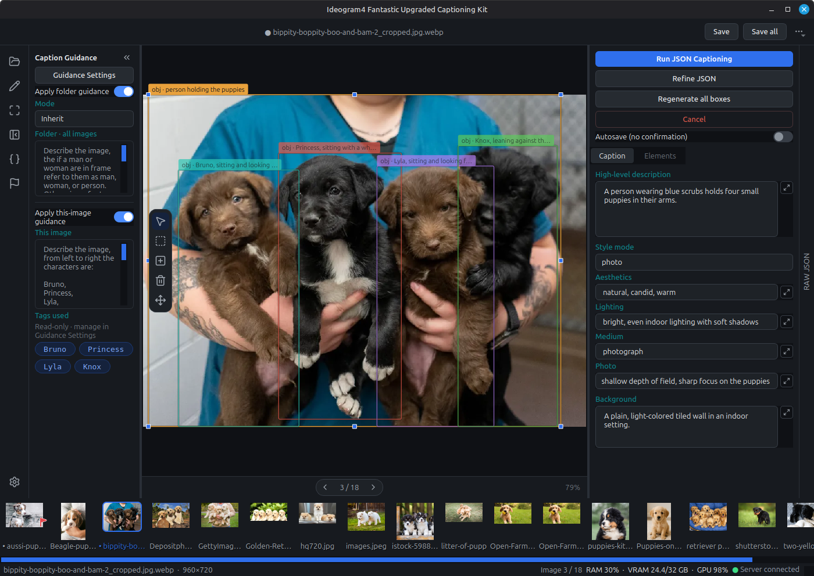
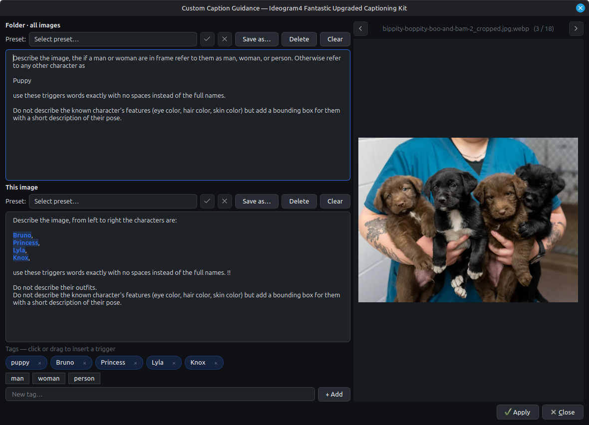

# Ideogram JSON Captioner

A local desktop app for building and curating image-caption datasets in
Ideogram 4's structured JSON caption format. Open a folder of images, write or
generate captions, draw bounding boxes, and keep your original text captions
alongside the structured JSON — all on your own machine.

Auto-captioning is optional and runs against an OpenAI-compatible model server
that **you** control (local llama.cpp, LM Studio, vLLM, or Ollama). Nothing
leaves your machine except the requests to the endpoint you configure.



## Features

- **Dataset browsing** — Step through an image folder with keyboard shortcuts.
  Sort and filter by name, date, missing captions, or failed jobs, and search
  inside caption sidecars to jump straight to the images you mean.
- **Structured caption editing** — Edit every Ideogram JSON field (description,
  style, background, elements, rendered text, color palette) in a native Qt
  form, with a live raw-JSON view. Original text captions (`.txt`, `.original`)
  stay separate from the structured JSON.
- **Bounding boxes** — Draw, move, resize, delete, and numerically edit
  object/text boxes directly on the image, with overlap-aware selection.
- **Caption guidance** — Attach folder-wide and per-image guidance (style,
  characters, things to always mention or avoid) that steers generation, plus
  reusable tag/trigger chips.
- **Local auto-captioning** — Generate the structured Ideogram JSON straight from
  an image, refine an existing caption, and run a bounding-box pass over the
  described elements (regenerate every box, or fill only the missing ones) — all
  through a local vision-language model you control. Caption the current image or
  the whole folder; when re-running an already-captioned folder you can limit it to
  new images, changed + new, or re-caption everything, and cancel a run at any time.
- **Caption review** — Captions that come back off-schema or corrupt — empty, a
  flat text blob instead of structured JSON, a model refusal, or a duplicate of
  another image's caption — are automatically flagged for review after a run, with
  a summary listing them. You can also browse and flag images yourself while a batch
  is still running, then jump straight between flagged images to fix them.
- **Bring your own model** — Pick from suggested Hugging Face GGUF models
  (auto-downloaded and served via llama.cpp), point at local GGUF files, or
  connect to a server you're already running. Your model choices live in a
  local, git-ignored profile file.

Manual captioning and box editing work fully offline; a model server is only
needed for the auto-captioning features.

## Requirements

- **Python 3.10 or newer**
- **For auto-captioning:** an OpenAI-compatible vision model server. The
  built-in option downloads a GGUF model and runs `llama-server` for you; you
  can also connect to LM Studio, vLLM, Ollama, or your own llama.cpp server.

## Installation

Clone the repository, then set up an environment with **either** venv or conda.
PySide6 is a large wheel (~150–200 MB), so the first install takes a minute.

```bash
git clone https://github.com/Adudeguyman/Ideogram-fantastic-upgraded-captioning-kit.git
cd Ideogram-fantastic-upgraded-captioning-kit
```

### Quickest start — auto-launcher (venv)

If you just want to run the app, use the bundled auto-launcher. On its first run
it creates a local `.venv`, installs the requirements, and starts the app; every
run after that launches straight away.

- **Windows:** double-click `run_captioner_venv.bat`, or run it from a terminal.
- **Linux / macOS:**
  ```bash
  chmod +x run_captioner_venv.sh   # once
  ./run_captioner_venv.sh
  ```

Prefer to manage the environment yourself? Set it up manually with venv or conda
below.

### Option A — venv

**Linux / macOS**
```bash
python -m venv .venv
source .venv/bin/activate
pip install -r requirements.txt
```

**Windows (PowerShell)**
```powershell
python -m venv .venv
.\.venv\Scripts\Activate.ps1
pip install -r requirements.txt
```

### Option B — conda

```bash
conda create -n id4caption python=3.11
conda activate id4caption
pip install -r requirements.txt
```

PySide6 installs cleanly with pip inside the conda env, so there's no need to
chase it down on a conda channel.

### Optional — CUDA acceleration for the built-in server (NVIDIA, Linux)

If you let the app download and run `llama-server` on an NVIDIA GPU, recent
llama.cpp CUDA builds link NVIDIA's NCCL library (`libnccl.so.2`) but don't
bundle it. If your environment already has PyTorch, you're covered — the app
reuses the NCCL it ships. Otherwise, add it once:

```bash
pip install -r requirements-cuda.txt        # or:  pip install ".[cuda]"
```

This is a no-op on Windows/macOS and on non-NVIDIA setups (the Vulkan/CPU
backends and external servers like LM Studio don't need it).

## Launching

With your environment activated (venv or conda), launch the app with:

```bash
python -m ideogram_captioner
```

or equivalently:

```bash
python run_captioner.py
```

**conda convenience launchers:** `run_captioner_conda.sh` (Linux / macOS) and
`run_captioner_conda.bat` (Windows) activate the `id4caption` environment for
you, then start the app:

```bash
chmod +x run_captioner_conda.sh   # once
./run_captioner_conda.sh
```

On Windows, double-click `run_captioner_conda.bat` (or run it from a terminal).
It prefers the env's `python.exe` directly and falls back to `call conda
activate id4caption`.

## Basic use

1. In **Preferences**, set up your server (Connection/Server) and choose the model
   it will use (Models). For an existing server, click **Refresh** to pick from the
   models it reports. Use **Test Server** to verify the connection. The server status
   is always shown in the bottom-right corner of the main window.

2. Open a folder of images. Per-dataset settings (guidance, tags, review flags) are
   saved in a **.captioner** folder inside it, so they're restored the next time you
   open that folder.

3. *(Optional)* Open **Guidance Settings** to add instructions for the model:
   - **Folder-level guidance** is appended to every image — e.g. for a consistent
     art style: *"For the high_level_description section, append the suffix
     'in the style of my_art_style'."*
   - **Per-image guidance** targets one image — e.g. when training multiple
     characters: *"From left to right the characters are CharacterOne,
     CharacterTwo…"*
   - **Tags** are part of the image-level guidance — reusable snippets you define
     once and reference as needed while writing an image's guidance, so recurring
     instructions don't have to be retyped per image.

   

4. Click **Run JSON Captioning** and choose **Caption Single Image** (the current
   image) or **Caption All Images**. If you run the whole folder and some images
   already have captions, a follow-up prompt lets you do *only new* images,
   *changed + new*, or *re-caption everything*.

5. While the folder runs, captions appear as they're generated. The caption editor
   is **read-only** during a run (a banner indicates this), but you can flag any
   image for later review with the **F** key or by right-clicking its thumbnail —
   flagged images show a red flag in the corner, and **Shift+F** jumps to the next
   flagged one.

6. To edit, select an image, change the fields and bounding boxes, then press
   `Ctrl+S` to save. Edits are buffered as you move between images; `Ctrl+Shift+S`
   writes every pending change to disk.

## Configuration

Both of these are local, git-ignored, and seeded from tracked `*.example`
templates, so your settings survive `git pull` and are never uploaded by
accident:

- **Model profiles** — `captioner_model_profiles.json`
  (*Preferences → Models → Open Profiles File*), seeded from
  `captioner_model_profiles.example.json`. Each profile is a small JSON entry
  pointing at a Hugging Face GGUF (`hf_repo` + `model_filename`, plus
  `mmproj_filename` for vision), a local GGUF file, or an existing-server alias.
- **Prompt overrides** — `captioner_prompts/`
  (*Preferences → Pipeline → Open Prompts Folder*). Copy only the files you want
  to change from `captioner_prompts.example/`; anything you don't override falls
  back to the built-in defaults.

## Keyboard shortcuts

- `Ctrl+O` — open a folder of images
- `Ctrl+S` — save the current image
- `Ctrl+Shift+S` — save all images with pending edits
- `Ctrl+[` / `Ctrl+]` — previous / next image
- `F` — flag the current image for review
- `Shift+F` — jump to the next flagged image
- `Ctrl+J` — toggle the raw JSON view
- `Ctrl+0` — fit the image to the canvas
- `Ctrl+\` — collapse / expand the guidance panel
- `Ctrl+,` — open Preferences
- Arrow keys — nudge the selected box by one unit when the canvas has focus
  (hold `Shift` for ×10); step between images when the filmstrip has focus
- `Delete` / `Backspace` — remove the selected box when the canvas has focus
- `Tab` / `Shift+Tab` — move between fields
- Hold `Space` (or middle-drag) — pan the canvas
- `F11` — toggle fullscreen

## Troubleshooting

- **`ModuleNotFoundError: No module named 'PySide6'`** — the environment isn't
  activated, or dependencies aren't installed. Activate it and re-run
  `pip install -r requirements.txt`.
- **Linux: `Could not load the Qt platform plugin "xcb"`** — a system library is
  missing on minimal installs. On Debian/Ubuntu/Mint:
  `sudo apt install libxcb-cursor0`.
- **Connection error during captioning** — the endpoint isn't reachable or the
  local server failed to start; check the URL in Preferences and any
  `server_logs/` output.
- **Built-in server won't start: `libnccl.so.2: cannot open shared object`** —
  the CUDA `llama-server` needs NVIDIA NCCL. Install it with
  `pip install -r requirements-cuda.txt` (or `pip install ".[cuda]"`); see the
  CUDA note under Installation.
- **Built-in server fails with CUDA out of memory** — another process is holding
  VRAM (often LM Studio with a model still loaded). Close it, or pick a smaller
  model. GPU layers default to auto-fit, so a slightly oversized model spills to
  CPU rather than aborting; set a fixed value in Preferences to override.
- **Empty output or `finish_reason=length`** — raise the context size / output
  tokens, lower the reasoning budget, or try a smaller image or model.
- **JSON errors after generation** — filter to failed captions and use
  **Retry Failed** with a stronger model or a larger context.
- **No bounding boxes** — confirm the selected model profile supports
  vision/bbox and has access to its `mmproj` file.

## License

MIT — see [LICENSE](LICENSE).
